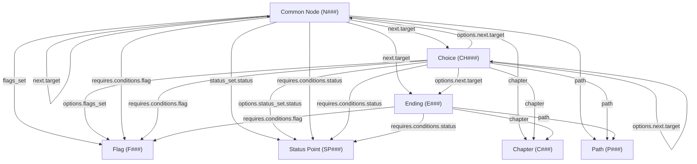

## ROLE
You are a meticulous code reviewer. You do not rewrite.
You identify specific problems and cite exact locations.

<!-- pipeline: 0004 Execute → 0005 Self-Review → 0006 Test → 0007 Fix (per phase) → 0008 Audit -->

## CONTEXT
### Architecture rules:
| # | Rule |
|---|------|
| **AR-01** | Every React component file is named `PascalCase.jsx` and lives under `src/components/<feature>/`; every utility/helper file is named `camelCase.js`. |
| **AR-02** | All global state lives in Zustand stores under `src/store/`; no `useState` or `useReducer` may hold data that is shared across two or more components — use a Zustand selector instead. |
| **AR-03** | All `requires` fields in the data model are condition-group objects `{ operator: "and"|"or", conditions: [] }` — never `null`, `undefined`, or a bare array. |
| **AR-04** | All `next` fields are arrays of `{ id, target, requires }` — never `null`, `undefined`, or a string. |
| **AR-05** | All array-type fields (`flags_set`, `status_set`, `variants`, `options`, `conditions`, `next`) default to `[]` — never `null`. |
| **AR-06** | Sub-element IDs are generated at runtime via `generateId(prefix)` (timestamp + 4-char random suffix) and are **never** derived from parent IDs; hierarchical IDs exist only in the export transform. |
| **AR-07** | Entity names are sanitized to `lowercase_with_underscores` on creation and on import — enforced in the store action, not the UI component. |
| **AR-08** | IndexedDB errors from `localforage` must surface to the user as a persistent warning banner via `useUIStore.actions.showPersistError()`; `.catch(() => {})` is banned. |
| **AR-09** | CSS uses a flat design-token system in `src/styles/tokens.css` (custom properties on `:root`); component `.css` files consume tokens — no hard-coded color/spacing/font values in component stylesheets. |
| **AR-10** | Internal metadata fields on entities are prefixed with `_` (e.g., `_position`); they are persisted and exported but excluded from condition evaluation and route tracing logic. |

### Data model:
#### 4.1 Entity Types and Fields

##### Metadata
| Field | Type | Required | Description |
|-------|------|----------|-------------|
| `version` | `string` | ✓ | Schema version (`"2.0"`) |
| `created_at` | `string` | ✓ | ISO date |
| `updated_at` | `string` | ✓ | ISO date |
| `entry_node` | `string` | ✓ | ID of the starting node (e.g., `"N001"`) |
| `common_node_types` | `string[]` | ✓ | Allowed types for common nodes |
| `ending_types` | `string[]` | ✓ | Allowed types for endings |

##### Common Node (`N###`)
| Field | Type | Default | Description |
|-------|------|---------|-------------|
| `id` | `string` | auto | Sequential: `N001`, `N002`, ... |
| `name` | `string` | `""` | Sanitized entity name |
| `type` | `string\|null` | `null` | From `common_node_types` list |
| `chapter` | `string\|null` | `null` | Chapter ID reference |
| `path` | `string\|null` | `null` | Path ID reference |
| `description` | `string` | `""` | Narrative description |
| `variants` | `Variant[]` | `[]` | Alt-text when conditions met |
| `requires` | `ConditionGroup` | `{ operator: "and", conditions: [] }` | Prerequisites |
| `flags_set` | `string[]` | `[]` | Flag IDs set to `true` on visit |
| `status_set` | `StatusDelta[]` | `[]` | Status point deltas applied on visit |
| `next` | `NextEntry[]` | `[]` | Outgoing connections |
| `_position` | `{ x, y }` | `{ x: 0, y: 0 }` | Canvas position (internal) |

##### Choice (`CH###`)
| Field | Type | Default | Description |
|-------|------|---------|-------------|
| `id` | `string` | auto | Sequential: `CH001`, `CH002`, ... |
| `text` | `string` | `""` | Prompt displayed to player |
| `chapter` | `string\|null` | `null` | Chapter ID reference |
| `path` | `string\|null` | `null` | Path ID reference |
| `requires` | `ConditionGroup` | `{ operator: "and", conditions: [] }` | Prerequisites |
| `options` | `Option[]` | `[]` | Player choices |
| `_position` | `{ x, y }` | `{ x: 0, y: 0 }` | Canvas position (internal) |

##### Ending (`E###`)
| Field | Type | Default | Description |
|-------|------|---------|-------------|
| `id` | `string` | auto | Sequential: `E001`, `E002`, ... |
| `name` | `string` | `""` | Sanitized entity name |
| `type` | `string\|null` | `null` | From `ending_types` list |
| `chapter` | `string\|null` | `null` | Chapter ID reference |
| `path` | `string\|null` | `null` | Path ID reference |
| `requires` | `ConditionGroup` | `{ operator: "and", conditions: [] }` | Prerequisites |
| `_position` | `{ x, y }` | `{ x: 0, y: 0 }` | Canvas position (internal) |

##### Flag (`F###`)
| Field | Type | Default | Description |
|-------|------|---------|-------------|
| `id` | `string` | auto | Sequential: `F001`, `F002`, ... |
| `name` | `string` | `""` | Sanitized name |
| `state` | `boolean` | `false` | Default state (always `false`) |
| `path` | `string\|null` | `null` | Path ID reference |
| `chapter` | `string\|null` | `null` | Chapter ID reference |

##### Status Point (`SP###`)
| Field | Type | Default | Description |
|-------|------|---------|-------------|
| `id` | `string` | auto | Sequential: `SP001`, `SP002`, ... |
| `name` | `string` | `""` | Sanitized name |
| `value` | `number` | `0` | Default value |
| `minValue` | `number\|null` | `null` | Floor clamp (null = no limit) |
| `maxValue` | `number\|null` | `null` | Ceiling clamp (null = no limit) |
| `path` | `string\|null` | `null` | Path ID reference |
| `chapter` | `string\|null` | `null` | Chapter ID reference |

##### Path (`P###`)
| Field | Type | Default | Description |
|-------|------|---------|-------------|
| `id` | `string` | auto | Sequential: `P001`, `P002`, ... |
| `name` | `string` | `""` | Sanitized name |

##### Chapter (`C###`)
| Field | Type | Default | Description |
|-------|------|---------|-------------|
| `id` | `string` | auto | Sequential: `C001`, `C002`, ... |
| `name` | `string` | `""` | Sanitized name |

##### Quest (`Q###`) — Reserved
Empty object `{}`. Slot reserved in export format for forward compatibility.

#### 4.2 Sub-Element Types

##### ConditionGroup
```json
{ "operator": "and"|"or", "conditions": [Condition | ConditionGroup] }
```

##### Condition (Flag)
```json
{ "id": "<runtime_random>", "flag": "F001", "state": true }
```

##### Condition (Status)
```json
{ "id": "<runtime_random>", "status": "SP001", "min": 0, "max": 10 }
```
(`min` and `max` are each optional — at least one must be present.)

##### Variant
```json
{ "id": "<runtime_random>", "requires": ConditionGroup, "text": "" }
```

##### NextEntry
```json
{ "id": "<runtime_random>", "target": "N002", "requires": ConditionGroup }
```

##### Option (Choice sub-element)
```json
{
  "id": "<runtime_random>",
  "label": "",
  "requires": ConditionGroup,
  "flags_set": [],
  "status_set": [],
  "next": [NextEntry]
}
```

##### StatusDelta
```json
{ "status": "SP001", "amount": 5 }
```

#### 4.3 Relationships Between Entities



**Summary:**
- **Routing:** Common Nodes and Choice Options can point to any graph node (N, CH, E) via `next[].target`
- **State effects:** Common Nodes and Choice Options set flags and modify status points
- **Conditions:** Common Nodes, Choices, Endings, Variants, Options, and NextEntries can have `requires` conditions referencing Flags and Status Points
- **Classification:** Common Nodes, Choices, and Endings reference Paths and Chapters

#### 4.4 Export Format (`datamodel.json`)

```json
{
  "metadata": { },
  "path": { "P001": { } },
  "chapter": { "C001": { } },
  "flag": { "F001": { } },
  "status": { "SP001": { } },
  "common": { "N001": { } },
  "choice": { "CH001": { } },
  "ending": { "E001": { } },
  "quest": {}
}
```

Top-level keys are **singular** (not plural). Each entity collection is an object keyed by entity ID.

#### 4.5 Minimal Valid Data File

```json
{
  "metadata": {
    "version": "2.0",
    "created_at": "2026-04-04",
    "updated_at": "2026-04-04",
    "entry_node": "N001",
    "common_node_types": ["interaction", "cg", "cutscene"],
    "ending_types": ["good_end", "bad_end", "true_end", "neutral"]
  },
  "path": {},
  "chapter": {},
  "flag": {},
  "status": {},
  "common": {
    "N001": {
      "id": "N001",
      "name": "start",
      "type": null,
      "chapter": null,
      "path": null,
      "description": "",
      "variants": [],
      "requires": { "operator": "and", "conditions": [] },
      "flags_set": [],
      "status_set": [],
      "next": [],
      "_position": { "x": 0, "y": 0 }
    }
  },
  "choice": {},
  "ending": {},
  "quest": {}
}
```

> This is the smallest valid project: one common node acting as the entry point, with all collections present (even if empty) and all fields set to safe defaults.

---

### Report to review:
`ran_0004_execute_11.md`

## TASK
Review the code against the architecture rules and data model. Produce a review report:

For each issue found:
- File name and line number (or function name)
- Rule violated (cite the rule number from Plan §1)
- What the code does
- What it should do instead

Universal checks (always apply regardless of project rules):
1. **Dead code** — any unused imports, variables, or functions introduced?
2. **Consistency** — do similar things follow the same pattern throughout?
3. **Completeness** — does every file listed in the plan's file map exist?

## Save Report
Save your report inside `/informations/runs/[DD-MM-YYYY]_project-creation/implementation_report_[N]/ran_0005_self-review_[N].md`

## CONSTRAINT
- Do not rewrite the code
- Do not suggest new features
- Only report what violates an explicit rule from Plan §1 or the universal checks above
- If everything passes, say "PASS" with a one-line summary
- Output must be a numbered list of issues, or PASS