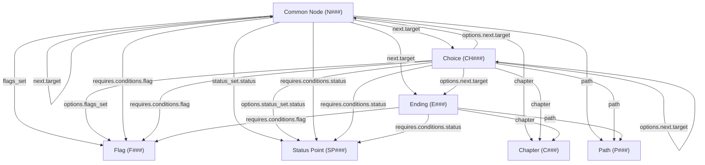
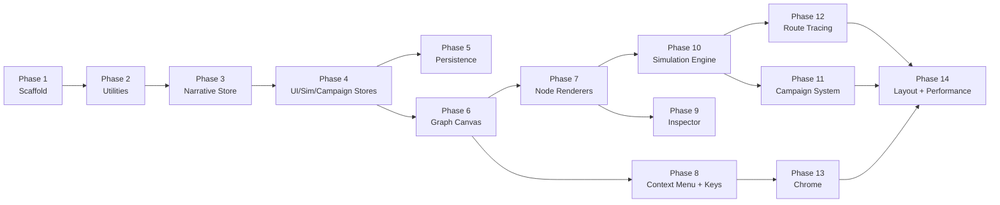

# Branching Routes V2 — Implementation Plan

> **Prompt:** `0003_plan.md`
> **Date:** 2026-04-04
> **Input:** Rebuild Spec (`v2_rebuild_spec.md`), Scope (`ran_0002_scope-user.md`)

---

## 1. Architecture Rules

> Rules are numbered AR-01 through AR-10. Every rule is testable in a Self-Review pass.

| # | Rule |
|---|------|
| **AR-01** | Every React component file is named `PascalCase.jsx` and lives under `src/components/<feature>/`; every utility/helper file is named `camelCase.js`. |
| **AR-02** | All global state lives in Zustand stores under `src/store/`; no `useState` or `useReducer` may hold data that is shared across two or more components — use a Zustand selector instead. |
| **AR-03** | All `requires` fields in the data model are condition-group objects `{ operator: "and"|"or", conditions: [] }` — never `null`, `undefined`, or a bare array. |
| **AR-04** | All `next` fields are arrays of `{ id, target, requires }` — never `null`, `undefined`, or a string. |
| **AR-05** | All array-type fields (`flags_set`, `status_set`, `variants`, `options`, `conditions`, `next`) default to `[]` — never `null`. |
| **AR-06** | Sub-element IDs are generated at runtime via `generateId(prefix)` (timestamp + 4-char random suffix) and are **never** derived from parent IDs; hierarchical IDs exist only in the export transform. |
| **AR-07** | Entity names are sanitized to `lowercase_with_underscores` on creation and on import — enforced in the store action, not the UI component. |
| **AR-08** | IndexedDB errors from `localforage` must surface to the user as a persistent warning banner via `useUIStore.actions.showPersistError()`; `.catch(() => {})` is banned. |
| **AR-09** | CSS uses a flat design-token system in `src/styles/tokens.css` (custom properties on `:root`); component `.css` files consume tokens — no hard-coded color/spacing/font values in component stylesheets. |
| **AR-10** | Internal metadata fields on entities are prefixed with `_` (e.g., `_position`); they are persisted and exported but excluded from condition evaluation and route tracing logic. |

---

## 2. Phases

Each phase is scoped to complete in **one Execute step**. Phases are sequential; each depends on the outputs of the previous.

---

### Phase 1 — Project Scaffold & Design Tokens

**Goal:** Establish the project foundation — working dev server, design token system, and clean entry point — so every subsequent phase has a runnable app to build on.

**Produces:**
- `src/styles/tokens.css` — CSS custom properties (colors, spacing, typography, radii, shadows)
- `src/styles/reset.css` — CSS reset / normalize
- `src/index.css` — imports tokens + reset, sets global body/html rules
- `src/main.jsx` — mounts `<App />`
- `src/App.jsx` — empty shell rendering a placeholder
- `vite.config.js` — alias `@/` → `src/`

**Acceptance Criteria:**
- [ ] `npm run dev` starts without errors and renders the placeholder App
- [ ] All design tokens are defined as CSS custom properties on `:root` in `tokens.css`
- [ ] No hard-coded color, spacing, or font values exist outside `tokens.css`
- [ ] `@/` import alias resolves correctly (verified by importing tokens in `App.jsx`)

**Next phase needs:** importable token system, working dev server.

---

### Phase 2 — Utility Layer

**Goal:** Build the pure-function utility layer that all stores, engines, and services depend on — ensuring ID generation, name sanitization, condition evaluation, and entity factories are testable in isolation.

**Produces:**
- `src/utils/generateId.js` — `generateId(prefix)` → `"prefix_<timestamp>_<4rand>"`
- `src/utils/sanitizeName.js` — lowercases and replaces non-alphanumeric with `_`
- `src/utils/deepEqual.js` — structural deep equality (replaces `JSON.stringify` comparison)
- `src/utils/conditionEval.js` — `evaluateCondition(conditionGroup, flagMap, statusMap) → boolean`
- `src/utils/entityDefaults.js` — factory functions: `createCommonNode()`, `createChoice()`, `createEnding()`, `createFlag()`, `createStatusPoint()`, `createPath()`, `createChapter()` — each returns a new entity with all fields set to safe defaults
- `src/utils/idTransform.js` — `toHierarchicalIds(dataModel) → exportData` and `toRuntimeIds(importData) → dataModel`

**Acceptance Criteria:**
- [ ] `generateId(prefix)` returns unique strings with no module-level mutable state
- [ ] `sanitizeName()` converts `"My Scene Name!"` → `"my_scene_name_"`
- [ ] `evaluateCondition()` correctly evaluates nested AND/OR groups with flag and status conditions
- [ ] Every entity factory returns an object satisfying AR-03 through AR-05 (condition groups, array fields default to `[]`)
- [ ] `toHierarchicalIds` → `toRuntimeIds` round-trip preserves data integrity (all fields present, sub-element IDs replaced)

**Next phase needs:** ID generation, entity factories, condition evaluator.

---

### Phase 3 — Zustand Stores (Narrative)

**Goal:** Implement the central data store that holds the entire narrative model, with complete CRUD operations for all entity types and JSON serialization — this is the single source of truth for the project.

**Produces:**
- `src/store/useNarrativeStore.js` — single store managing all narrative entity slices:
  - State shape: `{ metadata, path, chapter, flag, status, common, choice, ending, quest }`
  - Actions: full CRUD per entity type (`addCommonNode`, `updateCommonNode`, `deleteCommonNode`, etc.)
  - Actions: `addNextEntry`, `removeNextEntry`, `addCondition`, `removeCondition`, `addOption`, `removeOption`, `addVariant`, `removeVariant`
  - Actions: `loadFromJSON(json)`, `toExportJSON() → json`
  - Middleware: `subscribeWithSelector` for granular subscriptions

**Acceptance Criteria:**
- [ ] Can create, read, update, and delete every entity type (Common Node, Choice, Ending, Flag, Status Point, Path, Chapter)
- [ ] Sub-element CRUD works: add/remove conditions, next entries, options, variants
- [ ] `loadFromJSON()` populates the store from a valid JSON object; `toExportJSON()` produces a valid export
- [ ] Entity names are sanitized on creation (AR-07)
- [ ] All data structure invariants hold after every mutation (AR-03, AR-04, AR-05)
- [ ] Deleting a top-level entity cleans up references in `next[].target`, `flags_set`, `status_set`, and `requires.conditions`

**Next phase needs:** working narrative store with CRUD and export/import logic.

---

### Phase 4 — Zustand Stores (UI + Simulation + Campaign)

**Goal:** Complete the state management layer with stores for UI state, simulation state, and campaign management — giving all future UI components and engines the reactive data layer they need.

**Produces:**
- `src/store/useUIStore.js` — UI state:
  - `selectedNodeId`, `inspectorOpen`, `inspectorPinned`, `contextMenu`, `commandPaletteOpen`, `toasts[]`, `persistError`
  - Actions: `selectNode`, `openInspector`, `closeInspector`, `pinInspector`, `showContextMenu`, `hideContextMenu`, `addToast`, `removeToast`, `showPersistError`, `clearPersistError`
- `src/store/useSimulationStore.js` — simulation state:
  - `nodeStates: { [nodeId]: { status, seen } }`, `flagOverrides: {}`, `statusOverrides: {}`
  - Derived: `evaluatedEdges: { [edgeKey]: boolean }`, `unreachableNodes: Set`
  - Actions: `setNodeStatus`, `cycleNodeStatus`, `setNodeSeen`, `cycleNodeSeen`, `setFlagOverride`, `setStatusOverride`, `resetSimulation`
- `src/store/useCampaignStore.js` — campaign management:
  - `campaigns: {}`, `activeCampaignId`, `activeCampaign`
  - Actions: `createCampaign`, `loadCampaign`, `saveCampaign`, `deleteCampaign`, `switchCampaign`, `resetActiveCampaign`

**Acceptance Criteria:**
- [ ] `useUIStore` actions correctly toggle inspector, manage toasts (add/auto-remove), and track selected node
- [ ] `useSimulationStore.cycleNodeStatus()` cycles through all 6 states: `default → active → locked → complete → failed → branch_locked → default`
- [ ] `useSimulationStore.cycleNodeSeen()` cycles through: `unseen → partially_seen → seen → unseen`
- [ ] `useCampaignStore` can create, switch, reset, and delete campaigns; active campaign state is isolated from narrative data
- [ ] `showPersistError()` sets a persistent flag; `clearPersistError()` clears it (AR-08)

**Next phase needs:** all stores operational and subscribable.

---

### Phase 5 — Persistence Layer

**Goal:** Wire up IndexedDB persistence (auto-save with error surfacing) and JSON/ZIP import/export — ensuring the user never loses work silently and can round-trip data through files.

**Produces:**
- `src/services/persistence.js`
  - `saveProject(narrativeData, campaigns)` — writes to IndexedDB via localforage
  - `loadProject() → { narrativeData, campaigns }`
  - `clearProject()` — wipes stored data
  - Auto-save subscription: subscribes to narrative + campaign stores, debounces 500ms, calls `saveProject`, calls `useUIStore.showPersistError()` on failure
- `src/services/importExport.js`
  - `exportJSON(narrativeStore) → Blob` — applies `toHierarchicalIds`, downloads `.json`
  - `importJSON(file) → narrativeData` — parses, applies `toRuntimeIds`, sanitizes names, enforces data structure rules, loads into store
  - `exportZIP(narrativeStore, campaigns) → Blob` — `datamodel.json` + `campaigns/*.json`
  - `importZIP(file) → { narrativeData, campaigns }` — validates structure, handles all import rules from spec §6.2

**Acceptance Criteria:**
- [ ] Auto-save fires 500ms after the last store mutation and writes to IndexedDB
- [ ] If IndexedDB write fails, a persistent warning banner appears (AR-08); no `.catch(() => {})` anywhere
- [ ] `loadProject()` restores the full narrative + campaign state on app start
- [ ] JSON export → import round-trip produces identical data (sub-element IDs regenerated, structure preserved)
- [ ] ZIP import rejects archives missing `datamodel.json` with a specific error message
- [ ] Plain `.json` import works as data-model-only (no campaigns)

**Next phase needs:** persistence + import/export working end-to-end.

---

### Phase 6 — Graph Canvas Foundation

**Goal:** Get the full-viewport React Flow canvas rendering data-driven nodes and edges from the narrative store — the visual core of the application.

**Produces:**
- `src/components/graph/GraphCanvas.jsx` — full-viewport `<ReactFlow>` wrapper with pan/zoom/select, sets up node types and edge types
- `src/components/graph/GraphCanvas.css` — full-viewport styles, dark theme overrides for React Flow
- `src/hooks/useGraphSync.js` — hook that transforms narrative store data into React Flow `nodes[]` and `edges[]`, subscribes to store changes
- `src/hooks/useGraphCallbacks.js` — `onConnect`, `onNodesChange`, `onEdgesChange`, `onNodeDrag` callbacks wired to narrative store actions
- `src/App.jsx` — updated to render `<GraphCanvas />`

**Acceptance Criteria:**
- [ ] Graph canvas fills 100% of the viewport with dark-themed background
- [ ] Nodes from the narrative store render on the canvas at their `_position` coordinates
- [ ] Edges render between connected nodes based on `next[].target` references
- [ ] Pan, zoom, and multi-select interactions work
- [ ] Dragging a node updates `_position` in the narrative store
- [ ] Connecting two nodes via drag creates a `next` entry in the source entity

**Next phase needs:** functional graph canvas with data-driven nodes/edges.

---

### Phase 7 — Custom Node Renderers

**Goal:** Replace default React Flow nodes/edges with custom renderers that visually distinguish entity types, display metadata (badges, tags), and respond to simulation state — making the graph informative at a glance.

**Produces:**
- `src/components/graph/nodes/CommonNodeRenderer.jsx` — custom node for Common Nodes (shows name, type badge, chapter/path tags, flag/status indicators, state/seen overlays)
- `src/components/graph/nodes/CommonNodeRenderer.css`
- `src/components/graph/nodes/ChoiceNodeRenderer.jsx` — custom node for Choices (shows text, option count badge, condition indicator)
- `src/components/graph/nodes/ChoiceNodeRenderer.css`
- `src/components/graph/nodes/EndingNodeRenderer.jsx` — custom node for Endings (shows name, type badge, terminal indicator)
- `src/components/graph/nodes/EndingNodeRenderer.css`
- `src/components/graph/edges/ConditionalEdge.jsx` — custom edge rendering (solid when conditions pass, dashed/dimmed when fail, glow when active node outgoing)
- `src/components/graph/edges/ConditionalEdge.css`

**Acceptance Criteria:**
- [ ] Common Nodes, Choices, and Endings are visually distinct (different shape/color/icon)
- [ ] Node renderers display: entity name/text, type badge, chapter/path tags
- [ ] Common Node renderer shows flag/status indicators when `flags_set` or `status_set` are non-empty
- [ ] Edge renderer supports three visual states: solid (conditions pass), dashed/dimmed (conditions fail), glow (active node outgoing)
- [ ] All renderers consume design tokens from `tokens.css` — no hard-coded colors (AR-09)
- [ ] Nodes render correctly with the premium dark-mode aesthetic (deep charcoal, neon accents)

**Next phase needs:** visual nodes and edges rendering on the canvas with simulation-aware styling.

---

### Phase 8 — Context Menu & Keyboard Shortcuts

**Goal:** Implement the primary interaction model — context-sensitive right-click menus and keyboard shortcuts — so users can create, delete, and manipulate entities without any sidebar or toolbar.

**Produces:**
- `src/components/ui/ContextMenu.jsx` — right-click menu with context-sensitive options per spec §3.2
- `src/components/ui/ContextMenu.css`
- `src/hooks/useKeyboardShortcuts.js` — registers all keyboard shortcuts per spec §3.3, routes to store actions
- `src/hooks/useContextMenu.js` — manages context menu position and visibility, maps right-click targets to menu options

**Acceptance Criteria:**
- [ ] Right-click on empty canvas shows: Create Common Node, Create Choice, Create Ending, Create Flag, Create Status Point, Create Path, Create Chapter, Paste
- [ ] Right-click on a node shows: Edit, Delete, Duplicate, Connect to..., Toggle State, Toggle Seen, Copy
- [ ] Right-click on an edge shows: Delete, Edit Conditions
- [ ] All keyboard shortcuts from spec §3.3 are functional (`N`, `C`, `E`, `F`, `S`, `Del`, `Space`, `V`, `I`, `Ctrl+K`, `Escape`, `R`, `L`, `Ctrl+F`)
- [ ] Shortcuts are suppressed when a text input has focus
- [ ] Context menu closes on click-outside or `Escape`

**Next phase needs:** full interaction model (create/delete/connect via context menu + keyboard).

---

### Phase 9 — Floating Inspector Panel

**Goal:** Build the full entity editing UI as a draggable floating panel (like Figma's inspector), enabling users to edit all fields of any selected entity without leaving the graph canvas.

**Produces:**
- `src/components/inspector/InspectorPanel.jsx` — draggable, dismissible, pinnable floating panel for editing selected entity
- `src/components/inspector/InspectorPanel.css`
- `src/components/inspector/fields/TextField.jsx` — editable text field
- `src/components/inspector/fields/SelectField.jsx` — dropdown selector (chapter, path, type)
- `src/components/inspector/fields/ConditionEditor.jsx` — recursive condition group editor (AND/OR nesting, add/remove conditions)
- `src/components/inspector/fields/ConditionEditor.css`
- `src/components/inspector/fields/NextEditor.jsx` — array editor for `next` entries (target picker, condition sub-editor)
- `src/components/inspector/fields/VariantEditor.jsx` — array editor for `variants`
- `src/components/inspector/fields/OptionEditor.jsx` — array editor for Choice `options` (includes sub-fields for flags_set, status_set, next)
- `src/components/inspector/fields/FlagSetEditor.jsx` — multi-select for `flags_set`
- `src/components/inspector/fields/StatusSetEditor.jsx` — array editor for `status_set` entries

**Acceptance Criteria:**
- [ ] Clicking a node opens the inspector; `I` toggles it; `Escape` dismisses it (all dismissal paths check dirty state — AP8)
- [ ] Inspector is draggable, dismissible, and pinnable
- [ ] Fields follow the spec §2.1 ordering: identity → classification → content → prerequisites → side effects → routing
- [ ] ConditionEditor supports recursive AND/OR nesting with add/remove at any depth
- [ ] All edits write back to the narrative store immediately
- [ ] Inspector adapts its field layout based on entity type (Common Node vs. Choice vs. Ending vs. Flag vs. Status Point vs. Path vs. Chapter)

**Next phase needs:** complete entity editing through the inspector.

---

### Phase 10 — Simulation Engine

**Goal:** Implement the always-running simulation engine that recalculates edge validity, node reachability, and auto-lock suggestions on every state change — the core differentiator from V1.

**Produces:**
- `src/engine/simulationEngine.js`
  - `recalculate(narrativeData, campaignState) → { evaluatedEdges, unreachableNodes, autoLockSuggestions }`
  - Subscribes to narrative + simulation stores; debounces 150ms; pushes results into simulation store
- `src/engine/reachability.js`
  - `findUnreachableNodes(narrativeData, evaluatedEdges, entryNode) → Set<nodeId>`
  - BFS from entry node along passing edges
- `src/hooks/useSimulationSync.js` — hook that wires `simulationEngine` to stores, manages the subscription lifecycle
- Updated node renderers to read simulation state (edge highlighting, state badges, reachability warnings)

**Acceptance Criteria:**
- [ ] Simulation recalculates automatically within 150ms of any flag/status/node-state change — no start/stop button
- [ ] Edges visualization and those whose conditions pass are visually highlighted; edges that fail are dimmed/dashed
- [ ] Nodes marked `active` pulse and show valid outgoing edges glowing
- [ ] Unreachable nodes (from `entry_node` given current state) display a warning badge
- [ ] Node renderers display the correct state overlay: active (pulsing), locked (dimmed), complete (checkmark), failed (red/X), branch_locked (dashed)
- [ ] Seen tracking icons render: unseen (none), partially_seen (half-eye), seen (filled-eye)

**Next phase needs:** live simulation running, edges highlighted, unreachable warnings visible.

---

### Phase 11 — Campaign System

**Goal:** Enable designers to create, save, and switch between named campaign sheets (saved simulation states) for testing different narrative scenarios independently.

**Produces:**
- `src/components/campaign/CampaignSelector.jsx` — dropdown/modal for campaign CRUD (create, switch, delete, reset)
- `src/components/campaign/CampaignSelector.css`
- `src/components/campaign/FlagOverridePanel.jsx` — list of all flags with toggle switches for override
- `src/components/campaign/StatusOverridePanel.jsx` — list of all status points with number inputs for override
- Updated `persistence.js` to save/load campaigns alongside data model

**Acceptance Criteria:**
- [ ] Can create a new campaign with a name, switch between campaigns, delete campaigns
- [ ] Reset button clears all node states, flag overrides, and status overrides for the active campaign
- [ ] Flag overrides toggle individual flags; status overrides set specific values — both feed into the simulation engine
- [ ] Campaign state is separate from narrative data (AR-10: editing structure does not modify campaigns)
- [ ] Campaigns auto-save to IndexedDB alongside the data model
- [ ] Stale campaign references (referencing deleted entities) are pruned with a toast notification (R-03 mitigation)

**Next phase needs:** campaign-based simulation with state persistence.

---

### Phase 12 — Route Tracing

**Goal:** Build the route analysis system — all-paths finder, shortest path, goal-directed pathfinding (Modes A and B), and filtered tracing — with a visual overlay and detail panel for results.

**Produces:**
- `src/engine/routeTracer.js`
  - `findAllPaths(graph, fromId, toId, flagMap, statusMap) → Path[]`
  - `findShortestPath(graph, fromId, toId, flagMap, statusMap) → Path | null`
  - `findPathToGoal(graph, entryNode, targetId, flagMap, statusMap) → Path | null` (Mode A)
  - `findRequirementsForGoal(graph, entryNode, targetId) → RequirementSet` (Mode B)
  - `filterPaths(paths, filters) → Path[]`
- `src/engine/pathAnnotator.js`
  - `annotatePath(path, narrativeData) → AnnotatedPath` — adds chapter, path, flags set, status deltas per step
- `src/components/route/RouteFinderDialog.jsx` — modal for selecting source/target nodes and filters
- `src/components/route/RouteFinderDialog.css`
- `src/components/route/RouteOverlay.jsx` — visual overlay on graph canvas highlighting traced route with step numbers
- `src/components/route/RouteOverlay.css`
- `src/components/route/RouteDetailPanel.jsx` — expandable breakdown of each step in the route

**Acceptance Criteria:**
- [ ] Basic route trace finds all paths between two selected nodes
- [ ] Shortest path returns the path with fewest nodes and respects current flag/status state
- [ ] Mode A ("how to reach X?") finds a valid path or reports why no path exists (which conditions fail)
- [ ] Mode B ("what do I need for X?") returns required flags and status thresholds, with a 5-second timeout for complex graphs (R-02)
- [ ] Filtered trace correctly filters by path, chapter, flag, and status
- [ ] Route overlay highlights the traced path on the canvas with numbered steps
- [ ] Toast summary shows path result (e.g., "Shortest path: N001 → CH002 → N005 → E001, 4 nodes")
- [ ] Each route step is annotated with chapter, path, flags set, and status deltas

**Next phase needs:** route tracing fully operational with visual overlays.

---

### Phase 13 — Chrome (Top Bar, Status Strip, Command Palette, Toast)

**Goal:** Add the minimal application shell — top bar, bottom status strip, command palette, toast notifications, and minimap — completing the UI framework without adding persistent sidebars.

**Produces:**
- `src/components/chrome/TopBar.jsx` — thin single-line bar: project name (editable), settings, reset, import/export buttons
- `src/components/chrome/TopBar.css`
- `src/components/chrome/StatusStrip.jsx` — bottom bar: active node count, flags summary, status values, simulation warnings
- `src/components/chrome/StatusStrip.css`
- `src/components/chrome/CommandPalette.jsx` — `Ctrl+K` modal: search entities, execute actions, navigate
- `src/components/chrome/CommandPalette.css`
- `src/components/ui/ToastContainer.jsx` — top-right toast stack, auto-dismiss, driven by `useUIStore.toasts`
- `src/components/ui/ToastContainer.css`
- `src/components/ui/Minimap.jsx` — React Flow minimap wrapper with dark-themed styling

**Acceptance Criteria:**
- [ ] Top bar is thin (single-line), shows editable project name, settings gear, reset simulation, import/export buttons
- [ ] Status strip at the bottom shows: active node count, active flags summary, status point values, simulation warnings count
- [ ] Clicking a status strip item opens relevant detail
- [ ] Command palette opens on `Ctrl+K`, searches nodes/flags/status by name or ID, executes actions (Create Node, Export, Reset, Find path to...)
- [ ] Toasts appear top-right, auto-dismiss after a timeout, are stackable
- [ ] Minimap renders in a corner with dark-themed styling matching the app aesthetic
- [ ] No persistent sidebars exist — all editing through floating panels, context menus, and keyboard shortcuts (AR-12)
- [ ] Horizontal or Vertical node handle position's toggle.

**Next phase needs:** full UI chrome complete.

---

### Phase 14 — Auto-Layout & Performance Polish

**Goal:** Add Dagre auto-layout, performance optimizations for large graphs (200+ nodes), and visual clustering — the final polish pass before the project is considered feature-complete.

**Produces:**
- `src/engine/autoLayout.js`
  - `applyDagreLayout(nodes, edges, options) → positionedNodes` — uses `@dagrejs/dagre` for automatic positioning
- `src/engine/performanceOptimizer.js`
  - Node virtualization hints for React Flow
  - Memoization utilities for simulation recalculation with large graphs
  - Debounce tuning for 200+ node performance
- Updated keyboard shortcut `L` wired to auto-layout
- Updated simulation engine with incremental recalculation (only affected subgraph)
- Visual clustering by chapter/path (toggleable background grouping)

**Acceptance Criteria:**
- [ ] Pressing `L` runs Dagre auto-layout and repositions all nodes without data loss
- [ ] Simulation recalculation on a 200-node graph completes within 16ms (R-01 detection threshold)
- [ ] Incremental recalculation only processes the affected subgraph, not the full graph
- [ ] Visual clustering groups nodes by chapter/path with background shading, toggleable on/off
- [ ] No UI jank when rapidly toggling flags/statuses on a 200+ node graph

**Next phase needs:** nothing — this is the final phase.

---

## 3. File Map

> Every file created across all phases. Grouped by directory.

### `src/styles/`

| File | Purpose | Key Exports | Dependencies |
|------|---------|-------------|--------------|
| `tokens.css` | CSS custom properties for the entire design system: colors (deep charcoal, neon accents), spacing scale, typography (Inter), border radii, shadows, transitions | Custom properties on `:root` | None |
| `reset.css` | Browser reset / normalize | Global styles | None |

### `src/utils/`

| File | Purpose | Key Exports | Dependencies |
|------|---------|-------------|--------------|
| `generateId.js` | Unique ID generation with prefix | `generateId(prefix) → string` | None |
| `sanitizeName.js` | Entity name sanitization | `sanitizeName(name) → string` | None |
| `deepEqual.js` | Structural deep equality check | `deepEqual(a, b) → boolean` | None |
| `conditionEval.js` | Recursive condition group evaluation | `evaluateCondition(group, flagMap, statusMap) → boolean` | None |
| `entityDefaults.js` | Factory functions for all entity types | `createCommonNode(overrides)`, `createChoice(overrides)`, `createEnding(overrides)`, `createFlag(overrides)`, `createStatusPoint(overrides)`, `createPath(overrides)`, `createChapter(overrides)` | `generateId`, `sanitizeName` |
| `idTransform.js` | Export/import ID transformation | `toHierarchicalIds(dataModel) → exportData`, `toRuntimeIds(importData) → dataModel` | `generateId` |

### `src/store/`

| File | Purpose | Key Exports | Dependencies |
|------|---------|-------------|--------------|
| `useNarrativeStore.js` | Zustand store for all narrative entities | `useNarrativeStore` (hook + actions) | `entityDefaults`, `sanitizeName`, `generateId`, `idTransform` |
| `useUIStore.js` | Zustand store for UI state | `useUIStore` (hook + actions) | None |
| `useSimulationStore.js` | Zustand store for simulation state | `useSimulationStore` (hook + actions) | None |
| `useCampaignStore.js` | Zustand store for campaign management | `useCampaignStore` (hook + actions) | None |

### `src/services/`

| File | Purpose | Key Exports | Dependencies |
|------|---------|-------------|--------------|
| `persistence.js` | IndexedDB persistence via localforage, auto-save subscription | `saveProject()`, `loadProject()`, `clearProject()`, `initAutoSave()` | `localforage`, `useNarrativeStore`, `useCampaignStore`, `useUIStore` |
| `importExport.js` | JSON/ZIP import and export | `exportJSON()`, `importJSON(file)`, `exportZIP()`, `importZIP(file)` | `JSZip`, `idTransform`, `entityDefaults`, `sanitizeName`, `useNarrativeStore`, `useCampaignStore` |

### `src/hooks/`

| File | Purpose | Key Exports | Dependencies |
|------|---------|-------------|--------------|
| `useGraphSync.js` | Transforms store data → React Flow nodes/edges | `useGraphSync() → { nodes, edges }` | `useNarrativeStore`, `useSimulationStore` |
| `useGraphCallbacks.js` | React Flow event callbacks wired to stores | `useGraphCallbacks() → { onConnect, onNodesChange, ... }` | `useNarrativeStore`, `useUIStore` |
| `useKeyboardShortcuts.js` | Global keyboard shortcut listener | `useKeyboardShortcuts()` | `useNarrativeStore`, `useUIStore`, `useSimulationStore` |
| `useContextMenu.js` | Context menu position/visibility/target management | `useContextMenu() → { menuState, showMenu, hideMenu }` | `useUIStore` |
| `useSimulationSync.js` | Wires simulation engine to store subscriptions | `useSimulationSync()` | `simulationEngine`, `useNarrativeStore`, `useSimulationStore`, `useCampaignStore` |

### `src/components/graph/`

| File | Purpose | Key Exports | Dependencies |
|------|---------|-------------|--------------|
| `GraphCanvas.jsx` | Full-viewport React Flow wrapper | `<GraphCanvas />` | `@xyflow/react`, `useGraphSync`, `useGraphCallbacks`, node/edge renderers |
| `GraphCanvas.css` | Graph viewport styles | — | `tokens.css` |

### `src/components/graph/nodes/`

| File | Purpose | Key Exports | Dependencies |
|------|---------|-------------|--------------|
| `CommonNodeRenderer.jsx` | Custom node for Common Nodes | `<CommonNodeRenderer />` | `useSimulationStore`, `useNarrativeStore` |
| `CommonNodeRenderer.css` | Styling | — | `tokens.css` |
| `ChoiceNodeRenderer.jsx` | Custom node for Choices | `<ChoiceNodeRenderer />` | `useSimulationStore`, `useNarrativeStore` |
| `ChoiceNodeRenderer.css` | Styling | — | `tokens.css` |
| `EndingNodeRenderer.jsx` | Custom node for Endings | `<EndingNodeRenderer />` | `useSimulationStore`, `useNarrativeStore` |
| `EndingNodeRenderer.css` | Styling | — | `tokens.css` |

### `src/components/graph/edges/`

| File | Purpose | Key Exports | Dependencies |
|------|---------|-------------|--------------|
| `ConditionalEdge.jsx` | Custom edge with condition-aware rendering | `<ConditionalEdge />` | `useSimulationStore` |
| `ConditionalEdge.css` | Styling | — | `tokens.css` |

### `src/components/ui/`

| File | Purpose | Key Exports | Dependencies |
|------|---------|-------------|--------------|
| `ContextMenu.jsx` | Right-click context menu | `<ContextMenu />` | `useContextMenu`, `useNarrativeStore`, `useUIStore` |
| `ContextMenu.css` | Styling | — | `tokens.css` |
| `ToastContainer.jsx` | Toast notification stack | `<ToastContainer />` | `useUIStore` |
| `ToastContainer.css` | Styling | — | `tokens.css` |
| `Minimap.jsx` | React Flow minimap with dark styling | `<Minimap />` | `@xyflow/react` |

### `src/components/inspector/`

| File | Purpose | Key Exports | Dependencies |
|------|---------|-------------|--------------|
| `InspectorPanel.jsx` | Draggable floating editor panel | `<InspectorPanel />` | `useUIStore`, `useNarrativeStore`, field components |
| `InspectorPanel.css` | Styling | — | `tokens.css` |

### `src/components/inspector/fields/`

| File | Purpose | Key Exports | Dependencies |
|------|---------|-------------|--------------|
| `TextField.jsx` | Editable text input | `<TextField />` | None |
| `SelectField.jsx` | Dropdown selector | `<SelectField />` | None |
| `ConditionEditor.jsx` | Recursive AND/OR condition tree editor | `<ConditionEditor />` | `useNarrativeStore` (for flag/status lists) |
| `ConditionEditor.css` | Styling | — | `tokens.css` |
| `NextEditor.jsx` | `next` array editor | `<NextEditor />` | `ConditionEditor`, `useNarrativeStore` |
| `VariantEditor.jsx` | `variants` array editor | `<VariantEditor />` | `ConditionEditor` |
| `OptionEditor.jsx` | Choice `options` array editor | `<OptionEditor />` | `ConditionEditor`, `NextEditor`, `FlagSetEditor`, `StatusSetEditor` |
| `FlagSetEditor.jsx` | Multi-select for `flags_set` | `<FlagSetEditor />` | `useNarrativeStore` |
| `StatusSetEditor.jsx` | Array editor for `status_set` | `<StatusSetEditor />` | `useNarrativeStore` |

### `src/components/campaign/`

| File | Purpose | Key Exports | Dependencies |
|------|---------|-------------|--------------|
| `CampaignSelector.jsx` | Campaign CRUD dropdown/modal | `<CampaignSelector />` | `useCampaignStore` |
| `CampaignSelector.css` | Styling | — | `tokens.css` |
| `FlagOverridePanel.jsx` | Flag toggle switches for campaign state | `<FlagOverridePanel />` | `useNarrativeStore`, `useSimulationStore` |
| `StatusOverridePanel.jsx` | Status point number inputs for campaign state | `<StatusOverridePanel />` | `useNarrativeStore`, `useSimulationStore` |

### `src/components/route/`

| File | Purpose | Key Exports | Dependencies |
|------|---------|-------------|--------------|
| `RouteFinderDialog.jsx` | Modal for source/target selection + filters | `<RouteFinderDialog />` | `routeTracer`, `useNarrativeStore`, `useUIStore` |
| `RouteFinderDialog.css` | Styling | — | `tokens.css` |
| `RouteOverlay.jsx` | Graph overlay highlighting traced route | `<RouteOverlay />` | `useUIStore` |
| `RouteOverlay.css` | Styling | — | `tokens.css` |
| `RouteDetailPanel.jsx` | Expandable step-by-step route breakdown | `<RouteDetailPanel />` | `pathAnnotator` |

### `src/components/chrome/`

| File | Purpose | Key Exports | Dependencies |
|------|---------|-------------|--------------|
| `TopBar.jsx` | Thin top bar (project name, settings, import/export) | `<TopBar />` | `useNarrativeStore`, `useUIStore`, `importExport` |
| `TopBar.css` | Styling | — | `tokens.css` |
| `StatusStrip.jsx` | Bottom bar (stats, warnings) | `<StatusStrip />` | `useNarrativeStore`, `useSimulationStore` |
| `StatusStrip.css` | Styling | — | `tokens.css` |
| `CommandPalette.jsx` | `Ctrl+K` search + action modal | `<CommandPalette />` | `useNarrativeStore`, `useUIStore` |
| `CommandPalette.css` | Styling | — | `tokens.css` |

### `src/engine/`

| File | Purpose | Key Exports | Dependencies |
|------|---------|-------------|--------------|
| `simulationEngine.js` | Core simulation loop: evaluates edges, computes reachability, suggests auto-locks | `recalculate(narrativeData, campaignState) → SimResult` | `conditionEval`, `reachability` |
| `reachability.js` | BFS-based reachability analysis from entry node | `findUnreachableNodes(narrativeData, evaluatedEdges, entryNode) → Set` | None |
| `routeTracer.js` | All-paths finder, shortest path, goal-directed pathfinding (Mode A + B) | `findAllPaths()`, `findShortestPath()`, `findPathToGoal()`, `findRequirementsForGoal()`, `filterPaths()` | `conditionEval` |
| `pathAnnotator.js` | Annotates routes with chapter/path/flag/status info per step | `annotatePath(path, narrativeData) → AnnotatedPath` | None |
| `autoLayout.js` | Dagre-based automatic layout | `applyDagreLayout(nodes, edges, options) → positionedNodes` | `@dagrejs/dagre` |
| `performanceOptimizer.js` | Memoization + incremental recalculation helpers | `memoizeSimulation()`, `computeAffectedSubgraph()` | None |

---

## 4. Initial Data Model

### 4.1 Entity Types and Fields

#### Metadata
| Field | Type | Required | Description |
|-------|------|----------|-------------|
| `version` | `string` | ✓ | Schema version (`"2.0"`) |
| `created_at` | `string` | ✓ | ISO date |
| `updated_at` | `string` | ✓ | ISO date |
| `entry_node` | `string` | ✓ | ID of the starting node (e.g., `"N001"`) |
| `common_node_types` | `string[]` | ✓ | Allowed types for common nodes |
| `ending_types` | `string[]` | ✓ | Allowed types for endings |

#### Common Node (`N###`)
| Field | Type | Default | Description |
|-------|------|---------|-------------|
| `id` | `string` | auto | Sequential: `N001`, `N002`, ... |
| `name` | `string` | `""` | Sanitized entity name |
| `type` | `string\|null` | `null` | From `common_node_types` list |
| `chapter` | `string\|null` | `null` | Chapter ID reference |
| `path` | `string\|null` | `null` | Path ID reference |
| `description` | `string` | `""` | Narrative description |
| `variants` | `Variant[]` | `[]` | Alt-text when conditions met |
| `requires` | `ConditionGroup` | `{ operator: "and", conditions: [] }` | Prerequisites |
| `flags_set` | `string[]` | `[]` | Flag IDs set to `true` on visit |
| `status_set` | `StatusDelta[]` | `[]` | Status point deltas applied on visit |
| `next` | `NextEntry[]` | `[]` | Outgoing connections |
| `_position` | `{ x, y }` | `{ x: 0, y: 0 }` | Canvas position (internal) |

#### Choice (`CH###`)
| Field | Type | Default | Description |
|-------|------|---------|-------------|
| `id` | `string` | auto | Sequential: `CH001`, `CH002`, ... |
| `text` | `string` | `""` | Prompt displayed to player |
| `chapter` | `string\|null` | `null` | Chapter ID reference |
| `path` | `string\|null` | `null` | Path ID reference |
| `requires` | `ConditionGroup` | `{ operator: "and", conditions: [] }` | Prerequisites |
| `options` | `Option[]` | `[]` | Player choices |
| `_position` | `{ x, y }` | `{ x: 0, y: 0 }` | Canvas position (internal) |

#### Ending (`E###`)
| Field | Type | Default | Description |
|-------|------|---------|-------------|
| `id` | `string` | auto | Sequential: `E001`, `E002`, ... |
| `name` | `string` | `""` | Sanitized entity name |
| `type` | `string\|null` | `null` | From `ending_types` list |
| `chapter` | `string\|null` | `null` | Chapter ID reference |
| `path` | `string\|null` | `null` | Path ID reference |
| `requires` | `ConditionGroup` | `{ operator: "and", conditions: [] }` | Prerequisites |
| `_position` | `{ x, y }` | `{ x: 0, y: 0 }` | Canvas position (internal) |

#### Flag (`F###`)
| Field | Type | Default | Description |
|-------|------|---------|-------------|
| `id` | `string` | auto | Sequential: `F001`, `F002`, ... |
| `name` | `string` | `""` | Sanitized name |
| `state` | `boolean` | `false` | Default state (always `false`) |
| `path` | `string\|null` | `null` | Path ID reference |
| `chapter` | `string\|null` | `null` | Chapter ID reference |

#### Status Point (`SP###`)
| Field | Type | Default | Description |
|-------|------|---------|-------------|
| `id` | `string` | auto | Sequential: `SP001`, `SP002`, ... |
| `name` | `string` | `""` | Sanitized name |
| `value` | `number` | `0` | Default value |
| `minValue` | `number\|null` | `null` | Floor clamp (null = no limit) |
| `maxValue` | `number\|null` | `null` | Ceiling clamp (null = no limit) |
| `path` | `string\|null` | `null` | Path ID reference |
| `chapter` | `string\|null` | `null` | Chapter ID reference |

#### Path (`P###`)
| Field | Type | Default | Description |
|-------|------|---------|-------------|
| `id` | `string` | auto | Sequential: `P001`, `P002`, ... |
| `name` | `string` | `""` | Sanitized name |

#### Chapter (`C###`)
| Field | Type | Default | Description |
|-------|------|---------|-------------|
| `id` | `string` | auto | Sequential: `C001`, `C002`, ... |
| `name` | `string` | `""` | Sanitized name |

#### Quest (`Q###`) — Reserved
Empty object `{}`. Slot reserved in export format for forward compatibility.

### 4.2 Sub-Element Types

#### ConditionGroup
```json
{ "operator": "and"|"or", "conditions": [Condition | ConditionGroup] }
```

#### Condition (Flag)
```json
{ "id": "<runtime_random>", "flag": "F001", "state": true }
```

#### Condition (Status)
```json
{ "id": "<runtime_random>", "status": "SP001", "min": 0, "max": 10 }
```
(`min` and `max` are each optional — at least one must be present.)

#### Variant
```json
{ "id": "<runtime_random>", "requires": ConditionGroup, "text": "" }
```

#### NextEntry
```json
{ "id": "<runtime_random>", "target": "N002", "requires": ConditionGroup }
```

#### Option (Choice sub-element)
```json
{
  "id": "<runtime_random>",
  "label": "",
  "requires": ConditionGroup,
  "flags_set": [],
  "status_set": [],
  "next": [NextEntry]
}
```

#### StatusDelta
```json
{ "status": "SP001", "amount": 5 }
```

### 4.3 Relationships Between Entities



**Summary:**
- **Routing:** Common Nodes and Choice Options can point to any graph node (N, CH, E) via `next[].target`
- **State effects:** Common Nodes and Choice Options set flags and modify status points
- **Conditions:** Common Nodes, Choices, Endings, Variants, Options, and NextEntries can have `requires` conditions referencing Flags and Status Points
- **Classification:** Common Nodes, Choices, and Endings reference Paths and Chapters

### 4.4 Export Format (`datamodel.json`)

```json
{
  "metadata": { },
  "path": { "P001": { } },
  "chapter": { "C001": { } },
  "flag": { "F001": { } },
  "status": { "SP001": { } },
  "common": { "N001": { } },
  "choice": { "CH001": { } },
  "ending": { "E001": { } },
  "quest": {}
}
```

Top-level keys are **singular** (not plural). Each entity collection is an object keyed by entity ID.

### 4.5 Minimal Valid Data File

```json
{
  "metadata": {
    "version": "2.0",
    "created_at": "2026-04-04",
    "updated_at": "2026-04-04",
    "entry_node": "N001",
    "common_node_types": ["interaction", "cg", "cutscene"],
    "ending_types": ["good_end", "bad_end", "true_end", "neutral"]
  },
  "path": {},
  "chapter": {},
  "flag": {},
  "status": {},
  "common": {
    "N001": {
      "id": "N001",
      "name": "start",
      "type": null,
      "chapter": null,
      "path": null,
      "description": "",
      "variants": [],
      "requires": { "operator": "and", "conditions": [] },
      "flags_set": [],
      "status_set": [],
      "next": [],
      "_position": { "x": 0, "y": 0 }
    }
  },
  "choice": {},
  "ending": {},
  "quest": {}
}
```

> This is the smallest valid project: one common node acting as the entry point, with all collections present (even if empty) and all fields set to safe defaults.

---

## 5. Risk Register

| # | Risk | Likelihood | Impact | Detection | Mitigation |
|---|------|-----------|--------|-----------|------------|
| **R-01** | **Simulation performance degrades at 200+ nodes.** Recalculating reachability and condition evaluation on every flag/status toggle causes UI lag. | Medium | High | Profile `recalculate()` with a 200-node test fixture during Phase 10. Measure frame time; flag if > 16ms. | (1) Debounce recalculation at 150ms. (2) Implement incremental updates in Phase 14 — only recalculate the affected subgraph, not the entire graph. (3) Move heavy pathfinding to a Web Worker if profiling shows it blocks the main thread. |
| **R-02** | **Goal-directed pathfinding (Mode B) hits exponential worst-case.** Complex nested AND/OR conditions with mutual dependencies make constraint satisfaction intractable. | Medium | Medium | Instrument `findRequirementsForGoal()` with a wall-clock timeout check. Test with a graph containing 10+ interdependent conditions. | (1) Set a 5-second computation timeout; surface "analysis too complex" toast if exceeded. (2) Implement Mode A first (simpler BFS) — Mode B is Phase 12, can be descoped if needed. (3) Practically, narrative graphs rarely exceed 500 nodes or 20 interdependent conditions. |
| **R-03** | **Campaign references become stale after data model edits.** Renaming a node ID, deleting a flag, or removing a status point leaves orphan references in saved campaigns. | High | Low | Add a `validateCampaign(campaign, narrativeData)` function that scans for unknown IDs. Run it on campaign load and on every data model mutation. | (1) On entity delete/rename, scan active campaign and prune stale references automatically. (2) Unknown node IDs in `node_states` are silently dropped (campaign is advisory, not structural). (3) Show a one-time toast: "Campaign cleaned: removed 2 stale references." |
| **R-04** | **ZIP import fails or produces corrupt data.** JSZip extraction in the browser encounters an unexpected format, large file, or missing `datamodel.json`. | Low | High | Wrap all `importZIP` operations with structured error handling. Test with: empty ZIP, ZIP without `datamodel.json`, corrupt ZIP, ZIP > 10MB. | (1) Validate ZIP structure before extraction: reject if no `datamodel.json`. (2) Maintain plain `.json` import as fallback for data-model-only. (3) Surface all import errors as toast notifications with specific error messages (not generic "import failed"). |
| **R-05** | **ID renumbering cascade breaks references.** Renumbering `N001` → `N003` requires updating every `target`, `flag`, `status` reference across the entire data model. | Medium | High | Build a `findAllReferences(entityId, narrativeData) → Reference[]` utility with unit tests covering all reference locations (next.target, requires.conditions.flag, conditions.status, flags_set, status_set.status). | (1) Sub-element IDs are random and immune to this (AR-06). Only top-level IDs need replacement. (2) Implement renumbering as a single-pass bulk transformation with an explicit before/after mapping. (3) Consider making IDs permanent (no renumbering) and using display labels separately — this eliminates the problem entirely. |

---

## Appendix: Phase Dependency Graph



> **Note:** Phases 6–8 can run partially in parallel (Phase 6 must complete before 7 or 8 start, but 7 and 8 are independent of each other). Phase 14 depends on 11, 12, and 13 all being complete.
